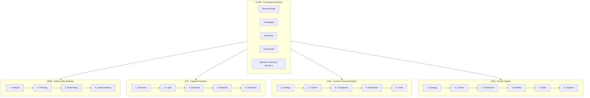
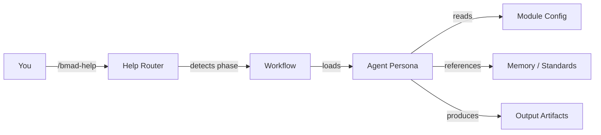
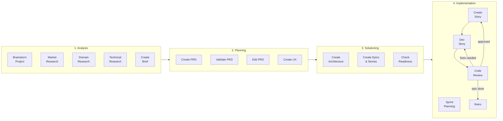
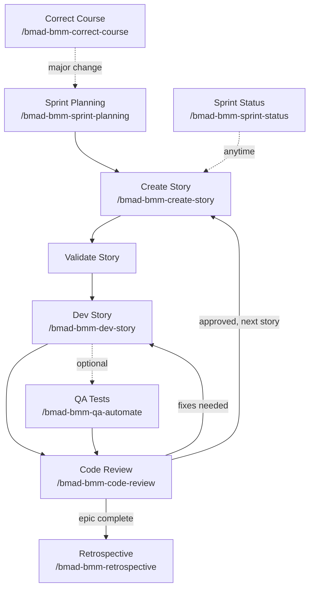

# BMAD Framework

**Build-Measure-Amplify-Deliver** | 67 Agents | 107 Workflows | 34 Tasks | 5 Modules

BMAD is a multi-module AI agent framework that orchestrates specialized personas across the full business lifecycle: from software development through capital formation, investor communications, and growth operations.

---

## Architecture Overview

---

## How It Works

Each module follows a phased workflow. Within each phase, **agents** (specialized AI personas) execute **workflows** (guided multi-step processes) and **tasks** (single-shot operations). The **Core** module provides cross-cutting services (brainstorming, debugging, research, editorial review) available to all modules.

---

## Quick Reference

| Need | Command | Module |
|------|---------|--------|
| Get unstuck / see next steps | `/bmad-help` | Core |
| Brainstorm ideas | `/bmad-brainstorming` | Core |
| Debug a problem | `/bmad-debugging` | Core |
| Research something | `/bmad-research` | Core |
| Quick spec + build | `/bmad-bmm-quick-spec` then `/bmad-bmm-quick-dev` | BMM |
| Full product lifecycle | Start with `/bmad-bmm-create-product-brief` | BMM |
| Autonomous task execution | `/bmad-bmm-autotask` | BMM |
| Multi-agent code review | `/bmad-bmm-multi-review` | BMM |
| Capital raise planning | `/bmad-ios-create-raise-strategy` | IOS |
| Investor communications | `/bmad-aos-create-offering-circular` | AOS |
| Growth strategy | `/bmad-gos-create-growth-strategy` | GOS |

---

## CORE Module

Foundation services available across all modules. Provides brainstorming, debugging, research, editorial review, and session management.

### Core Agents

| Agent | Name | Role | File |
|-------|------|------|------|
| BMad Master | -- | Knowledge custodian, workflow orchestrator | [bmad-master.md](./core/agents/bmad-master.md) |
| Prompt Engineer | Cipher | LLM-to-LLM prompt design specialist | [prompt-engineer.md](./core/agents/prompt-engineer.md) |

### Core Workflows

| Workflow | Command | Description | File |
|----------|---------|-------------|------|
| Brainstorming | `/bmad-brainstorming` | Generate diverse ideas through interactive creative techniques | [workflow.md](./core/workflows/brainstorming/workflow.md) |
| Debugging | `/bmad-debugging` | Systematic root-cause analysis before writing fixes | [workflow.md](./core/workflows/debugging/workflow.md) |
| Research | `/bmad-research` | Web research and documentation gathering (quick-check or deep-dive) | [workflow.md](./core/workflows/research/workflow.md) |
| Party Mode | `/bmad-party-mode` | Multi-agent discussions with diverse perspectives | [workflow.md](./core/workflows/party-mode/workflow.md) |

### Core Tasks

| Task | Command | Description | File |
|------|---------|-------------|------|
| Help | `/bmad-help` | Show next workflow steps based on current phase | [help.md](./core/tasks/help.md) |
| Index Docs | `/bmad-index-docs` | Create lightweight index for quick LLM scanning | [index-docs.xml](./core/tasks/index-docs.xml) |
| Shard Document | `/bmad-shard-doc` | Split large documents into smaller files by section | [shard-doc.xml](./core/tasks/shard-doc.xml) |
| Editorial - Prose | `/bmad-editorial-review-prose` | Review prose for clarity, tone, and flow | [editorial-review-prose.xml](./core/tasks/editorial-review-prose.xml) |
| Editorial - Structure | `/bmad-editorial-review-structure` | Propose cuts, reorganization, simplification | [editorial-review-structure.xml](./core/tasks/editorial-review-structure.xml) |
| Adversarial Review | `/bmad-review-adversarial-general` | Critical review to find issues and weaknesses | [review-adversarial-general.xml](./core/tasks/review-adversarial-general.xml) |
| Handoff Context | `/bmad-handoff-context` | Generate context for new sessions or team members | [handoff-context.xml](./core/tasks/handoff-context.xml) |
| Load Coding Standards | `/bmad-load-coding-standards` | Load standards from memory based on tech stack | [load-coding-standards.xml](./core/tasks/load-coding-standards.xml) |
| Session Save | `/bmad-session-save` | Save session state for later resumption | [session-save.xml](./core/tasks/session-save.xml) |
| Workflow Executor | -- | Execute a given workflow by loading config and instructions | [workflow.xml](./core/tasks/workflow.xml) |

### Memory & Standards

| Resource | Description | File |
|----------|-------------|------|
| Coding Standards | 33 standards covering code style, architecture, testing, deployment | [index.md](./_memory/coding-standards/index.md) |
| Communication Styles | 7 AI personality configurations (Samantha, etc.) | [index.md](./_memory/communication-styles/index.md) |
| Prompt Engineering | LLM-to-LLM communication best practices | [guide.md](./_memory/prompt-engineering/guide.md) |

---

## BMM Module - Build & Ship Software

The software development lifecycle from product discovery through implementation. Supports full Agile ceremony (analysis, planning, architecture, sprint execution) and fast-track Quick Flow for smaller tasks.

### BMM Workflow Pipeline

### BMM Sprint Cycle (Detail)

### BMM Core Team Agents

| Agent | Name | Role | File |
|-------|------|------|------|
| Analyst | Mary | Business analysis, market research, frameworks | [analyst.md](./bmm/agents/analyst.md) |
| Architect | Winston | Technical architecture and system design | [architect.md](./bmm/agents/architect.md) |
| Developer | Amelia | Implementation, coding, dev workflows | [dev.md](./bmm/agents/dev.md) |
| Product Manager | John | PRD creation, requirements, prioritization | [pm.md](./bmm/agents/pm.md) |
| QA Engineer | Quinn | Test automation, quality assurance | [qa.md](./bmm/agents/qa.md) |
| Scrum Master | Bob | Sprint planning, ceremonies, team facilitation | [sm.md](./bmm/agents/sm.md) |
| UX Designer | Sally | User experience design and prototyping | [ux-designer.md](./bmm/agents/ux-designer.md) |
| Tech Writer | Paige | Documentation, explanations, mermaid diagrams | [tech-writer.md](./bmm/agents/tech-writer/tech-writer.md) |
| Quick Flow | Barry | Fast-track spec and dev for simple tasks | [quick-flow-solo-dev.md](./bmm/agents/quick-flow-solo-dev.md) |

### BMM Review & Quality Agents

Specialized reviewers that run individually or in parallel via `/bmad-bmm-multi-review`.

| Agent | Name | Focus | File |
|-------|------|-------|------|
| Architecture Auditor | Sentry | Coupling, testability, change resistance | [architecture-auditor.md](./bmm/agents/architecture-auditor.md) |
| Comment Analyzer | Gloss | Comment accuracy, stale docs, misleading notes | [comment-analyzer.md](./bmm/agents/comment-analyzer.md) |
| Debugger | Trace | Root-cause analysis, evidence-based debugging | [debugger.md](./bmm/agents/debugger.md) |
| Error Handling Reviewer | Catch | Silent failures, missing catches, error surfacing | [error-handling-reviewer.md](./bmm/agents/error-handling-reviewer.md) |
| Git Writer | Quill | Commit messages, PR descriptions, branch names | [git-writer.md](./bmm/agents/git-writer.md) |
| Library Advisor | Atlas | Package evaluation, build-vs-buy decisions | [library-advisor.md](./bmm/agents/library-advisor.md) |
| Logic Reviewer | Vera | Logic bugs, edge cases, off-by-one, race conditions | [logic-reviewer.md](./bmm/agents/logic-reviewer.md) |
| Observability Reviewer | Lens | Logging, error tracking, production debuggability | [observability-reviewer.md](./bmm/agents/observability-reviewer.md) |
| Performance Reviewer | Blaze | N+1 queries, algorithmic complexity, efficiency | [performance-reviewer.md](./bmm/agents/performance-reviewer.md) |
| Recovery Reviewer | Phoenix | Dead-end error paths, missing retry/recovery | [recovery-reviewer.md](./bmm/agents/recovery-reviewer.md) |
| Robustness Reviewer | Iron | Production readiness, fragile code, resilience | [robustness-reviewer.md](./bmm/agents/robustness-reviewer.md) |
| Security Reviewer | Shield | Injection flaws, auth issues, OWASP vulnerabilities | [security-reviewer.md](./bmm/agents/security-reviewer.md) |
| Simplifier | Zen | Reduce complexity, eliminate redundancy | [simplifier.md](./bmm/agents/simplifier.md) |
| Style Reviewer | Flair | Naming conventions, codebase pattern consistency | [style-reviewer.md](./bmm/agents/style-reviewer.md) |
| Test Analyzer | Probe | Test coverage gaps, brittle tests, wrong assertions | [test-analyzer.md](./bmm/agents/test-analyzer.md) |
| Test Engineer | Forge | Write unit/integration tests, prove code works | [test-engineer.md](./bmm/agents/test-engineer.md) |
| Test Runner | Sprint | Run tests, report pass/fail, terse output | [test-runner.md](./bmm/agents/test-runner.md) |

### BMM Workflows

#### Phase 1 - Analysis

| Workflow | Code | Command | Agent | File |
|----------|------|---------|-------|------|
| Brainstorm Project | BP | `/bmad-brainstorming` | Mary (Analyst) | [workflow.md](./core/workflows/brainstorming/workflow.md) |
| Market Research | MR | `/bmad-bmm-market-research` | Mary (Analyst) | [workflow.md](./bmm/workflows/1-analysis/research/workflow-market-research.md) |
| Domain Research | DR | `/bmad-bmm-domain-research` | Mary (Analyst) | [workflow.md](./bmm/workflows/1-analysis/research/workflow-domain-research.md) |
| Technical Research | TR | `/bmad-bmm-technical-research` | Mary (Analyst) | [workflow.md](./bmm/workflows/1-analysis/research/workflow-technical-research.md) |
| Create Brief | CB | `/bmad-bmm-create-product-brief` | Mary (Analyst) | [workflow.md](./bmm/workflows/1-analysis/create-product-brief/workflow.md) |

#### Phase 2 - Planning

| Workflow | Code | Command | Agent | File |
|----------|------|---------|-------|------|
| Create PRD | CP | `/bmad-bmm-create-prd` | John (PM) | [workflow.md](./bmm/workflows/2-plan-workflows/create-prd/workflow-create-prd.md) |
| Validate PRD | VP | `/bmad-bmm-validate-prd` | John (PM) | [workflow.md](./bmm/workflows/2-plan-workflows/create-prd/workflow-validate-prd.md) |
| Edit PRD | EP | `/bmad-bmm-edit-prd` | John (PM) | [workflow.md](./bmm/workflows/2-plan-workflows/create-prd/workflow-edit-prd.md) |
| Create UX | CU | `/bmad-bmm-create-ux-design` | Sally (UX) | [workflow.md](./bmm/workflows/2-plan-workflows/create-ux-design/workflow.md) |

#### Phase 3 - Solutioning

| Workflow | Code | Command | Agent | File |
|----------|------|---------|-------|------|
| Create Architecture | CA | `/bmad-bmm-create-architecture` | Winston (Architect) | [workflow.md](./bmm/workflows/3-solutioning/create-architecture/workflow.md) |
| Create Epics & Stories | CE | `/bmad-bmm-create-epics-and-stories` | John (PM) | [workflow.md](./bmm/workflows/3-solutioning/create-epics-and-stories/workflow.md) |
| Check Readiness | IR | `/bmad-bmm-check-implementation-readiness` | Winston (Architect) | [workflow.md](./bmm/workflows/3-solutioning/check-implementation-readiness/workflow.md) |

#### Phase 4 - Implementation

| Workflow | Code | Command | Agent | File |
|----------|------|---------|-------|------|
| Sprint Planning | SP | `/bmad-bmm-sprint-planning` | Bob (SM) | [workflow.yaml](./bmm/workflows/4-implementation/sprint-planning/workflow.yaml) |
| Sprint Status | SS | `/bmad-bmm-sprint-status` | Bob (SM) | [workflow.yaml](./bmm/workflows/4-implementation/sprint-status/workflow.yaml) |
| Create Story | CS | `/bmad-bmm-create-story` | Bob (SM) | [workflow.yaml](./bmm/workflows/4-implementation/create-story/workflow.yaml) |
| Dev Story | DS | `/bmad-bmm-dev-story` | Amelia (Dev) | [workflow.yaml](./bmm/workflows/4-implementation/dev-story/workflow.yaml) |
| QA Automation | QA | `/bmad-bmm-qa-automate` | Quinn (QA) | [workflow.yaml](./bmm/workflows/qa/automate/workflow.yaml) |
| Code Review | CR | `/bmad-bmm-code-review` | Amelia (Dev) | [workflow.yaml](./bmm/workflows/4-implementation/code-review/workflow.yaml) |
| Retrospective | ER | `/bmad-bmm-retrospective` | Bob (SM) | [workflow.yaml](./bmm/workflows/4-implementation/retrospective/workflow.yaml) |

#### Anytime Utilities

| Workflow | Code | Command | Description | File |
|----------|------|---------|-------------|------|
| Autotask | AT | `/bmad-bmm-autotask` | Autonomous task execution, description to PR-ready | [workflow.md](./bmm/workflows/4-implementation/autotask/workflow.md) |
| Multi-Review | MV | `/bmad-bmm-multi-review` | Parallel multi-agent code review | [workflow.md](./bmm/workflows/4-implementation/multi-review/workflow.md) |
| Address PR Comments | APC | `/bmad-bmm-address-pr-comments` | Triage and resolve bot review feedback | [workflow.md](./bmm/workflows/4-implementation/address-pr-comments/workflow.md) |
| Polish Sweep | PS | `/bmad-bmm-polish-sweep` | Final quality pass across code, docs, tests | [workflow.md](./bmm/workflows/4-implementation/polish-sweep/workflow.md) |
| Resolve Issue | RI | `/bmad-bmm-resolve-issue` | Autonomous GitHub issue triage to PR delivery | [workflow.md](./bmm/workflows/4-implementation/resolve-issue/workflow.md) |
| Troubleshoot | TS | `/bmad-bmm-troubleshoot` | Production error triage and resolution | [workflow.md](./bmm/workflows/4-implementation/troubleshoot/workflow.md) |
| Upgrade Deps | UD | `/bmad-bmm-upgrade-deps` | Dependency scanning, changelog analysis, upgrades | [workflow.md](./bmm/workflows/4-implementation/upgrade-deps/workflow.md) |
| Verify Fix | VF | `/bmad-bmm-verify-fix` | Evidence-based fix verification | [workflow.md](./bmm/workflows/4-implementation/verify-fix/workflow.md) |
| Quick Spec | QS | `/bmad-bmm-quick-spec` | Fast-track spec for simple tasks | [workflow.md](./bmm/workflows/bmad-quick-flow/quick-spec/workflow.md) |
| Quick Dev | QD | `/bmad-bmm-quick-dev` | Fast-track development for simple tasks | [workflow.md](./bmm/workflows/bmad-quick-flow/quick-dev/workflow.md) |
| Correct Course | CC | `/bmad-bmm-correct-course` | Navigate significant project changes | [workflow.yaml](./bmm/workflows/4-implementation/correct-course/workflow.yaml) |
| Document Project | DP | `/bmad-bmm-document-project` | Analyze existing project, produce documentation | [workflow.yaml](./bmm/workflows/document-project/workflow.yaml) |
| Generate Context | GPC | `/bmad-bmm-generate-project-context` | Scan codebase to generate LLM-optimized context | [workflow.md](./bmm/workflows/generate-project-context/workflow.md) |
| Write Document | WD | -- | Load Tech Writer agent, describe what you need | [tech-writer.md](./bmm/agents/tech-writer/tech-writer.md) |

---

## IOS Module - Capital Formation

End-to-end capital raise execution: from strategy and legal structuring through financial modeling, materials preparation, and investor readiness.

### IOS Workflow Pipeline

```mermaid
graph LR
    subgraph D["1. Discovery"]
        RS["Raise\nStrategy"]
        SF["Strategic\nFoundation"]
        MR["Market\nResearch"]
        CA["Competitive\nAnalysis"]
        IT["Investor\nTargeting"]
        DS["Deal\nStructure"]
        TR["Tier\nRouting"]
        EP["Engagement\nPlan"]
    end

    subgraph L["2. Legal"]
        ES["Entity\nStructure"]
        RC["Regulatory\nCompliance"]
        ID["Investment\nDocs"]
    end

    subgraph F["3. Financial"]
        FM["Financial\nModel"]
        VR["Valuation\nReport"]
        CT["Cap\nTable"]
        SM["Staffing\nModel"]
    end

    subgraph M["4. Materials"]
        DR["Data\nRoom"]
        IN["Investor\nNarrative"]
        OB["Operational\nBlueprint"]
        PP["Platform\nPlan"]
        BG["Brand\nGuidelines"]
    end

    subgraph E["5. Execution"]
        ST["Status"]
        QC["Quality\nCheck"]
        VX["Validate\nCross-Refs"]
        IR["Investor\nReadiness"]
    end

    D --> L --> F --> M --> E
```

### IOS Agents

| Agent | Name | Role | File |
|-------|------|------|------|
| Investment Strategist | Alexander | Capital formation, deal structure, strategy | [investment-strategist.md](./ios/agents/investment-strategist.md) |
| Narrative Director | Cassandra | Strategic narrative, positioning, brand voice | [narrative-director.md](./ios/agents/narrative-director.md) |
| Market Intelligence | Diana | Market research, competitive analysis | [market-intelligence.md](./ios/agents/market-intelligence.md) |
| Engagement Lead | Priya | Project orchestration, delivery management | [engagement-lead.md](./ios/agents/engagement-lead.md) |
| Securities Counsel | Victoria | Securities law, regulatory architecture | [securities-counsel.md](./ios/agents/securities-counsel.md) |
| Financial Modeler | Marcus | Financial modeling, valuation, cap tables | [financial-modeler.md](./ios/agents/financial-modeler.md) |
| Operations Strategist | Raymond | Operational blueprints, staffing models | [operations-strategist.md](./ios/agents/operations-strategist.md) |
| Data Room Architect | Helena | Due diligence, document organization | [data-room-architect.md](./ios/agents/data-room-architect.md) |
| Platform Architect | Nikolai | Investor portal design and architecture | [platform-architect.md](./ios/agents/platform-architect.md) |
| Quick Flow Delivery | Kai | Fast single-deliverable execution | [quick-flow-delivery.md](./ios/agents/quick-flow-delivery.md) |

### IOS Workflows

<strong>Phase 1 - Discovery</strong> (8 workflows)

| Workflow | Code | Command | Agent |
|----------|------|---------|-------|
| Create Raise Strategy | RS | `/bmad-ios-create-raise-strategy` | Alexander |
| Create Strategic Foundation | SF | `/bmad-ios-create-strategic-foundation` | Cassandra |
| Market Research (Investment) | MR | `/bmad-ios-market-research-investment` | Diana |
| Competitive Analysis | CA | `/bmad-ios-competitive-analysis` | Diana |
| Investor Targeting | IT | `/bmad-ios-investor-targeting` | Alexander |
| Deal Structure | DS | `/bmad-ios-deal-structure` | Alexander |
| Tier Routing | TR | `/bmad-ios-tier-routing` | Priya |
| Create Engagement Plan | EP | `/bmad-ios-create-engagement-plan` | Priya |

<strong>Phase 2 - Legal</strong> (3 workflows)

| Workflow | Code | Command | Agent |
|----------|------|---------|-------|
| Create Entity Structure | ES | `/bmad-ios-create-entity-structure` | Victoria |
| Regulatory Compliance Routing | RC | `/bmad-ios-regulatory-compliance-routing` | Victoria |
| Create Investment Docs | ID | `/bmad-ios-create-investment-docs` | Victoria |

<strong>Phase 3 - Financial</strong> (5 workflows)

| Workflow | Code | Command | Agent |
|----------|------|---------|-------|
| Create Financial Model | FM | `/bmad-ios-create-financial-model` | Marcus |
| Create Valuation Report | VR | `/bmad-ios-create-valuation-report` | Marcus |
| Model Cap Table | CT | `/bmad-ios-model-cap-table` | Marcus |
| Validate Financial Model | VM | `/bmad-ios-validate-financial-model` | Marcus |
| Create Staffing Model | SM | `/bmad-ios-create-staffing-model` | Raymond |

<strong>Phase 4 - Materials</strong> (6 workflows)

| Workflow | Code | Command | Agent |
|----------|------|---------|-------|
| Create Data Room | DR | `/bmad-ios-create-data-room` | Helena |
| Create Investor Narrative | IN | `/bmad-ios-create-investor-narrative` | Cassandra |
| Create Operational Blueprint | OB | `/bmad-ios-create-operational-blueprint` | Raymond |
| Plan Investor Platform | PP | `/bmad-ios-plan-investor-platform` | Nikolai |
| Design Investor Platform | DP | `/bmad-ios-design-investor-platform` | Nikolai |
| Create Brand Guidelines | BG | `/bmad-ios-create-brand-guidelines` | Cassandra |

<strong>Phase 5 - Execution</strong> (4 workflows)

| Workflow | Code | Command | Agent |
|----------|------|---------|-------|
| Engagement Status | ST | `/bmad-ios-engagement-status` | Priya |
| Quality Check | QC | `/bmad-ios-quality-check` | Priya |
| Validate Cross-References | VX | `/bmad-ios-validate-cross-references` | Helena |
| Investor Readiness | IR | `/bmad-ios-investor-readiness` | Alexander |

### IOS Tasks

| Task | Description | File |
|------|-------------|------|
| Check Document Completeness | Verify all required fundraising documents present | [check-document-completeness.xml](./ios/tasks/check-document-completeness.xml) |
| SEC Compliance Review | Review investment documents for SEC compliance | [compliance-review-sec.xml](./ios/tasks/compliance-review-sec.xml) |
| Investor Readiness Scorecard | 8-dimension readiness score with gap analysis | [investor-readiness-scorecard.xml](./ios/tasks/investor-readiness-scorecard.xml) |
| Review Entity Structure | Review legal entity structure for efficiency | [review-entity-structure.xml](./ios/tasks/review-entity-structure.xml) |
| Review Valuation Methodology | Validate valuation methodology and assumptions | [review-valuation-methodology.xml](./ios/tasks/review-valuation-methodology.xml) |
| Validate Cross-References | Verify cross-document figure and claim consistency | [validate-cross-references.xml](./ios/tasks/validate-cross-references.xml) |
| Validate Engagement Plan | Check engagement plan completeness and sequencing | [validate-engagement-plan.xml](./ios/tasks/validate-engagement-plan.xml) |
| Validate Financial Model | Stress-test model integrity and calculations | [validate-financial-model.xml](./ios/tasks/validate-financial-model.xml) |

---

## AOS Module - Investor Communications

Regulated investor communications: from brand voice and compliance framework through content production, review gates, distribution campaigns, and crisis management.

### AOS Workflow Pipeline

```mermaid
graph LR
    subgraph S["1. Strategy"]
        BV["Brand\nVoice"]
        CF["Compliance\nFramework"]
        IS["Investor\nSegmentation"]
        MI["Market\nIntel"]
    end

    subgraph C["2. Content"]
        OC["Offering\nCircular"]
        ID["Investor\nDeck"]
        EC["Email\nCampaign"]
        VS["Video\nScripts"]
        LP["Landing\nPages"]
        SC["Social\nContent"]
        FP["Financial\nPackage"]
    end

    subgraph R["3. Review"]
        CR["Content\nCompliance"]
        OR["Offering\nReview"]
        DRV["Disclosure\nReview"]
        FG["Final\nGate"]
    end

    subgraph D["4. Distribution"]
        CC["Create\nCampaign"]
        CP["Campaign\nPlanning"]
        CS["Campaign\nStatus"]
        RD["Roadshow"]
    end

    subgraph X["5. Crisis"]
        CRX["Crisis\nResponse"]
        SEC["SEC Comment\nResponse"]
        RT["Campaign\nRetro"]
    end

    S --> C --> R --> D --> X
```

### AOS Agents

| Agent | Name | Role | File |
|-------|------|------|------|
| Brand Voice Strategist | Zoe | Brand voice and visual identity | [aos-brand.md](./aos/agents/aos-brand.md) |
| Compliance Counsel | Sarah | Compliance review framework | [aos-compliance.md](./aos/agents/aos-compliance.md) |
| Content Production | Emma | Investor content creation | [aos-content.md](./aos/agents/aos-content.md) |
| Financial Communications | Michael | Metrics, narratives, financial FAQ | [aos-fincomm.md](./aos/agents/aos-fincomm.md) |
| Market Intelligence | Jordan | Competitive landscape, investor sentiment | [aos-intel.md](./aos/agents/aos-intel.md) |
| Investor Relations | Amanda | Relationship management, roadshows | [aos-ir.md](./aos/agents/aos-ir.md) |
| Campaign Orchestrator | Diana | Multi-channel campaign execution | [aos-orchestrator.md](./aos/agents/aos-orchestrator.md) |
| Compliance Reviewer | Marcus | QA gate, regulatory review | [aos-reviewer.md](./aos/agents/aos-reviewer.md) |
| Crisis Management | Victoria | Crisis response, SEC comments | [aos-crisis.md](./aos/agents/aos-crisis.md) |
| Quick Content Producer | Carlos | Fast single-deliverable content | [aos-quickflow.md](./aos/agents/aos-quickflow.md) |

<strong>AOS Workflows</strong> (24 workflows across 5 phases + quick flow)

#### Phase 1 - Strategy Foundation
| Workflow | Command | Agent |
|----------|---------|-------|
| Brand Voice Setup | `/bmad-aos-brand-voice-setup` | Zoe |
| Compliance Framework | `/bmad-aos-compliance-framework` | Sarah |
| Investor Segmentation | `/bmad-aos-investor-segmentation` | Amanda |
| Market Intelligence | `/bmad-aos-market-intelligence` | Jordan |

#### Phase 2 - Content Production
| Workflow | Command | Agent |
|----------|---------|-------|
| Create Offering Circular | `/bmad-aos-create-offering-circular` | Emma |
| Create Investor Deck | `/bmad-aos-create-investor-deck` | Emma |
| Create Email Campaign | `/bmad-aos-create-email-campaign` | Emma |
| Create Video Scripts | `/bmad-aos-create-video-scripts` | Emma |
| Create Landing Pages | `/bmad-aos-create-landing-pages` | Emma |
| Create Social Content | `/bmad-aos-create-social-content` | Emma |
| Financial Content Package | `/bmad-aos-financial-content-package` | Michael |

#### Phase 3 - Review & Compliance
| Workflow | Command | Agent |
|----------|---------|-------|
| Content Compliance Review | `/bmad-aos-content-compliance-review` | Marcus |
| Offering Document Review | `/bmad-aos-offering-document-review` | Marcus |
| Disclosure Review | `/bmad-aos-disclosure-review` | Marcus |
| Final Gate Review | `/bmad-aos-final-gate-review` | Marcus |

#### Phase 4 - Distribution & Campaign
| Workflow | Command | Agent |
|----------|---------|-------|
| Create Campaign | `/bmad-aos-create-campaign` | Diana |
| Campaign Planning | `/bmad-aos-campaign-planning` | Diana |
| Campaign Status | `/bmad-aos-campaign-status` | Diana |
| Create Roadshow | `/bmad-aos-create-roadshow` | Amanda |

#### Phase 5 - Crisis & Ongoing
| Workflow | Command | Agent |
|----------|---------|-------|
| Crisis Response | `/bmad-aos-crisis-response` | Victoria |
| SEC Comment Response | `/bmad-aos-sec-comment-response` | Victoria |
| Campaign Retrospective | `/bmad-aos-campaign-retrospective` | Diana |

### AOS Tasks

| Task | Description | File |
|------|-------------|------|
| Brand Voice Check | Verify brand voice consistency | [brand-voice-check.xml](./aos/tasks/brand-voice-check.xml) |
| Compliance Content Review | Review content for regulatory compliance | [compliance-content-review.xml](./aos/tasks/compliance-content-review.xml) |
| Content Performance Analysis | Analyze content performance metrics | [content-performance-analysis.xml](./aos/tasks/content-performance-analysis.xml) |
| Crisis Assessment | Assess crisis severity and response level | [crisis-assessment.xml](./aos/tasks/crisis-assessment.xml) |
| Disclosure Completeness Check | Verify all disclosures are complete | [disclosure-completeness-check.xml](./aos/tasks/disclosure-completeness-check.xml) |
| Investor Update Generation | Generate investor update documents | [investor-update-generation.xml](./aos/tasks/investor-update-generation.xml) |
| Offering Type Detection | Detect and categorize offering type | [offering-type-detection.xml](./aos/tasks/offering-type-detection.xml) |
| SEC Comment Response | Prepare responses to SEC comments | [sec-comment-response.xml](./aos/tasks/sec-comment-response.xml) |

---

## GOS Module - Growth Engine

Full-funnel growth operations: from strategy and unit economics through content production, distribution, pipeline automation, sales enablement, and analytics.

### GOS Workflow Pipeline

### GOS Agents

#### Strategy & Analytics

| Agent | Name | Role | File |
|-------|------|------|------|
| Growth Strategist | Theo | Growth strategy, unit economics, channel prioritization | [growth-strategist.md](./gos/agents/growth-strategist.md) |
| Growth Analyst | Soren | Analytics, experimentation, hypothesis-driven metrics | [growth-analyst.md](./gos/agents/growth-analyst.md) |
| Sales Strategist | Vivienne | Sales strategy, playbooks, revenue operations | [sales-strategist.md](./gos/agents/sales-strategist.md) |
| SEO Strategist | Akira | SEO strategy, keyword targeting, search performance | [seo-strategist.md](./gos/agents/seo-strategist.md) |
| Pipeline Architect | Roman | Pipeline architecture, lead scoring, automation | [pipeline-architect.md](./gos/agents/pipeline-architect.md) |

#### Content & Distribution

| Agent | Name | Role | File |
|-------|------|------|------|
| Content Architect | Margot | Content strategy, editorial direction | [content-architect.md](./gos/agents/content-architect.md) |
| Creative Director | Jax | Multi-format creative production, brand voice | [creative-director.md](./gos/agents/creative-director.md) |
| Email Architect | Serena | Email lifecycle automation, nurture sequences | [email-architect.md](./gos/agents/email-architect.md) |
| Social Commander | Luna | Platform-native social media, community growth | [social-commander.md](./gos/agents/social-commander.md) |
| Outreach Director | Piper | Partnerships, PR, distribution relationships | [outreach-director.md](./gos/agents/outreach-director.md) |
| Paid Acquisition | Declan | Paid media, ROAS optimization, ad creative | [paid-acquisition.md](./gos/agents/paid-acquisition.md) |
| Quick Flow | Dash | Fast single-deliverable growth content | [gos-quick-flow.md](./gos/agents/gos-quick-flow.md) |

#### UX & Design Review

| Agent | Name | Focus | File |
|-------|------|-------|------|
| Design Reviewer | Maven | Visual quality, design system consistency | [gos-design-reviewer.md](./gos/agents/gos-design-reviewer.md) |
| Empathy Reviewer | Sage | User empathy, experience quality | [gos-empathy-reviewer.md](./gos/agents/gos-empathy-reviewer.md) |
| Mobile UX Reviewer | Swift | Mobile-first UX, touch interactions, responsive | [gos-mobile-ux-reviewer.md](./gos/agents/gos-mobile-ux-reviewer.md) |
| SEO Implementation | Pixel | Technical SEO, on-page optimization | [gos-seo-implementation.md](./gos/agents/gos-seo-implementation.md) |
| UX Clarity Reviewer | Crystal | Conversion path clarity, user feedback gaps | [gos-ux-clarity-reviewer.md](./gos/agents/gos-ux-clarity-reviewer.md) |
| UX Consistency Reviewer | Echo | Cross-page design consistency, interaction patterns | [gos-ux-consistency-reviewer.md](./gos/agents/gos-ux-consistency-reviewer.md) |
| UX Designer | Aria | UX design for growth products, conversion optimization | [gos-ux-designer.md](./gos/agents/gos-ux-designer.md) |

<strong>GOS Workflows</strong> (35 workflows across 6 phases + quick flow)

#### Phase 1 - Strategy
| Workflow | Command | Agent |
|----------|---------|-------|
| Create Growth Strategy | `/bmad-gos-create-growth-strategy` | Theo |
| Create Growth Model | `/bmad-gos-create-growth-model` | Theo |
| Create Customer Personas | `/bmad-gos-create-customer-personas` | Theo |
| Create Channel Strategy | `/bmad-gos-create-channel-strategy` | Theo |
| Competitive Positioning | `/bmad-gos-competitive-positioning` | Theo |
| Create Product Brand Voice | `/bmad-gos-create-product-brand-voice` | Jax |

#### Phase 2 - Content Engine
| Workflow | Command | Agent |
|----------|---------|-------|
| Create Content Strategy | `/bmad-gos-create-content-strategy` | Margot |
| Create SEO Strategy | `/bmad-gos-create-seo-strategy` | Akira |
| Create Blog Content | `/bmad-gos-create-blog-content` | Margot |
| Create Social Content | `/bmad-gos-create-social-content` | Luna |
| Create Email Sequences | `/bmad-gos-create-email-sequences` | Serena |
| Create Video Content | `/bmad-gos-create-video-content` | Margot |
| Create Podcast Plan | `/bmad-gos-create-podcast-plan` | Margot |

#### Phase 3 - Distribution
| Workflow | Command | Agent |
|----------|---------|-------|
| Create Social Campaigns | `/bmad-gos-create-social-campaigns` | Luna |
| Create Paid Campaigns | `/bmad-gos-create-paid-campaigns` | Declan |
| Launch Campaign | `/bmad-gos-launch-campaign` | Declan |
| Create PR Campaign | `/bmad-gos-create-pr-campaign` | Piper |
| Create Partner Program | `/bmad-gos-create-partner-program` | Piper |
| Create Event Strategy | `/bmad-gos-create-event-strategy` | Piper |

#### Phase 4 - Pipeline
| Workflow | Command | Agent |
|----------|---------|-------|
| Create Pipeline Architecture | `/bmad-gos-create-pipeline-architecture` | Roman |
| Create Lead Scoring | `/bmad-gos-create-lead-scoring` | Roman |
| Create Nurture Sequences | `/bmad-gos-create-nurture-sequences` | Serena |
| Create Onboarding Flow | `/bmad-gos-create-onboarding-flow` | Roman |
| Create Sales Playbooks | `/bmad-gos-create-sales-playbooks` | Vivienne |

#### Phase 5 - Sales
| Workflow | Command | Agent |
|----------|---------|-------|
| Create Sales Scripts | `/bmad-gos-create-sales-scripts` | Vivienne |
| Create Proposal Templates | `/bmad-gos-create-proposal-templates` | Vivienne |
| Create Closing Workflows | `/bmad-gos-create-closing-workflows` | Vivienne |
| Create Upsell Strategy | `/bmad-gos-create-upsell-strategy` | Vivienne |

#### Phase 6 - Analytics
| Workflow | Command | Agent |
|----------|---------|-------|
| Growth Dashboard | `/bmad-gos-growth-dashboard` | Soren |
| Campaign Performance | `/bmad-gos-campaign-performance` | Soren |
| Funnel Analysis | `/bmad-gos-funnel-analysis` | Soren |
| Growth Experiments | `/bmad-gos-growth-experiments` | Soren |
| Retention Analysis | `/bmad-gos-retention-analysis` | Soren |

### GOS Tasks

| Task | Code | Description | File |
|------|------|-------------|------|
| Content Audit | T-CA | Audit content for gaps and optimization opportunities | [content-audit.xml](./gos/tasks/content-audit.xml) |
| SEO Audit | T-SE | Technical and content SEO audit | [seo-audit.xml](./gos/tasks/seo-audit.xml) |
| Campaign Performance Review | T-CR | Analyze campaign metrics and recommend optimizations | [campaign-performance-review.xml](./gos/tasks/campaign-performance-review.xml) |
| Pipeline Health Check | T-PH | Review pipeline stages, conversion rates, velocity | [pipeline-health-check.xml](./gos/tasks/pipeline-health-check.xml) |
| Brand Consistency Check | T-BC | Review brand voice and visual consistency | [brand-consistency-check.xml](./gos/tasks/brand-consistency-check.xml) |
| Channel ROI Analysis | T-RA | Compare channel performance, recommend budget shifts | [channel-roi-analysis.xml](./gos/tasks/channel-roi-analysis.xml) |
| Competitor Content Analysis | T-CC | Analyze competitor strategy, identify gaps | [competitor-content-analysis.xml](./gos/tasks/competitor-content-analysis.xml) |
| Lead Scoring Validation | T-LV | Validate scoring model against actual conversions | [lead-scoring-validation.xml](./gos/tasks/lead-scoring-validation.xml) |

---

## Framework Totals

| Module | Agents | Workflows | Tasks | Purpose |
|--------|--------|-----------|-------|---------|
| **Core** | 2 | 4 | 10 | Foundation services for all modules |
| **BMM** | 27 | 26 | -- | Software development lifecycle |
| **IOS** | 10 | 28 | 8 | Capital formation and investor readiness |
| **AOS** | 10 | 24 | 8 | Regulated investor communications |
| **GOS** | 18 | 35 | 8 | Full-funnel growth operations |
| **Total** | **67** | **117** | **34** | |

---

## Configuration

Each module has its own `config.yaml` with project-specific settings:

| Config | Purpose | File |
|--------|---------|------|
| BMM Config | Project name, artifact paths, user settings | [config.yaml](./bmm/config.yaml) |
| Core Config | User name, language, output folder | [config.yaml](./core/config.yaml) |
| IOS Config | Capital formation settings | [config.yaml](./ios/config.yaml) |
| AOS Config | Communications settings | [config.yaml](./aos/config.yaml) |
| GOS Config | Growth engine settings, channel config | [config.yaml](./gos/config.yaml) |
| Memory Config | Reference directory index | [config.yaml](./_memory/config.yaml) |
| Manifest | Module versions, installation metadata | [manifest.yaml](./_config/manifest.yaml) |
| Help Catalog | Full workflow routing table | [bmad-help.csv](./_config/bmad-help.csv) |
