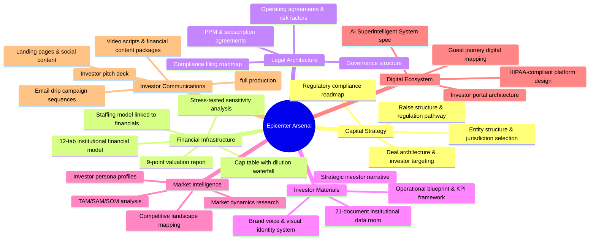
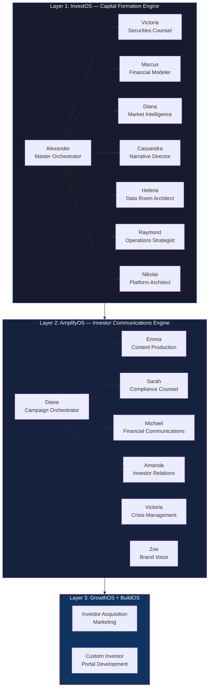
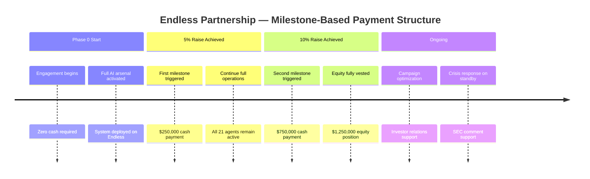
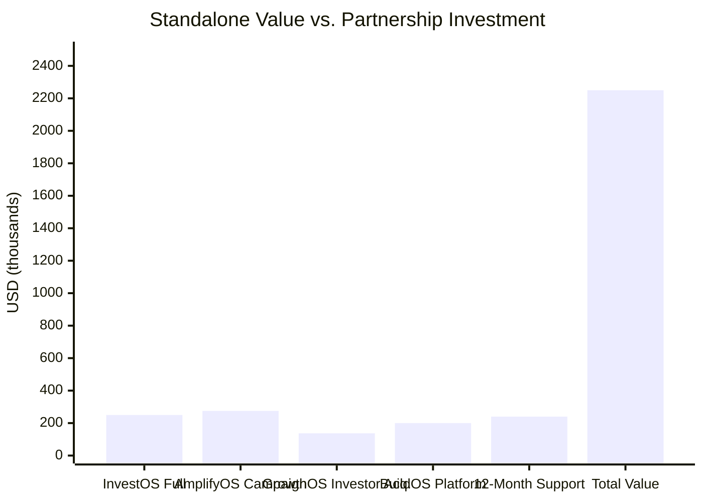
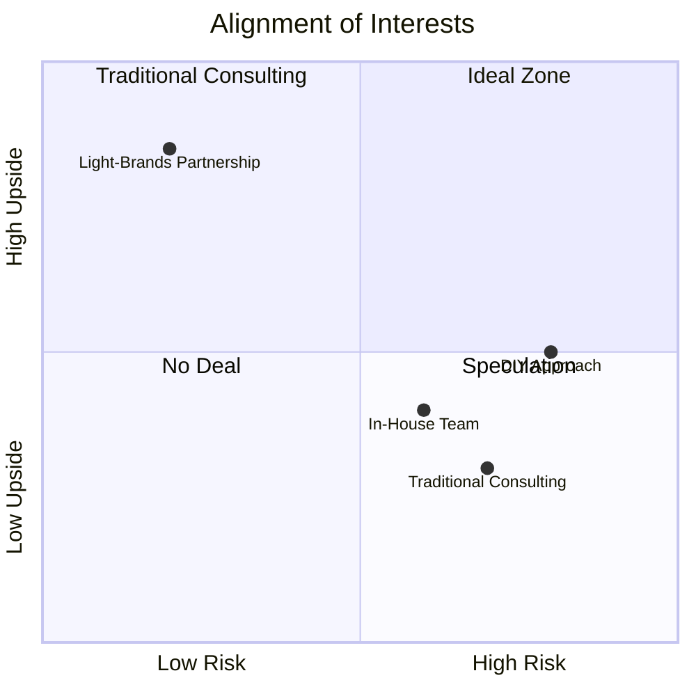
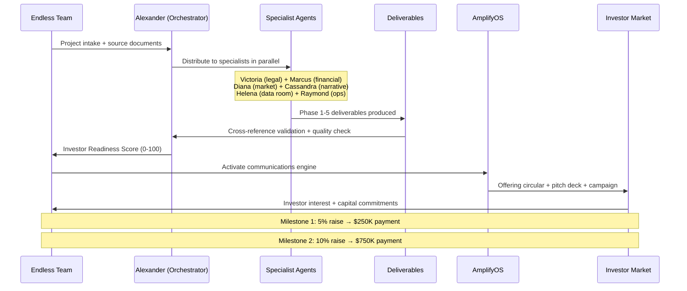

# AI Fundraising Intelligence — Endless Partnership Proposal

**Prepared by:** Light-Brands Intelligence Team
**Date:** February 16, 2026
**Partnership Type:** Strategic AI Technology & Capital Formation Alliance
**Version:** 2.0

---

## A Story Worth Telling

Imagine you're standing at the edge of a capital raise. You know the vision is right. You know the market is real. But between where you are today and a funded company lies a mountain of complexity — securities law, financial modeling, investor narratives, data rooms, campaign strategy, compliance reviews, roadshow logistics — and the clock is ticking.

Most founders at this stage hire a patchwork of consultants. Each one smart, but siloed. A securities attorney who doesn't talk to the narrative strategist. A financial modeler who hasn't read the market research. A PR firm that doesn't understand the deal structure. Months of coordination. Massive cost. And still, the raise takes longer than it should.

**This is the problem we solved.**

We built a full-stack AI capital formation intelligence system — 21 specialist AI agents working in concert across every dimension of a capital raise. Not a software platform you license. Not a consulting team you manage. A living intelligence system that ingests your story, understands your market, and produces institutional-grade raise materials faster and more rigorously than any traditional approach.

We deployed this system on a live raise — **Transformational Epicenter** — and built 25+ investor documents, a complete financial model, entity architecture, investor narrative, and full campaign infrastructure in the time it would typically take to get a first draft from a traditional firm.

Now we want to deploy it for Endless.

---

## Executive Summary

| | |
|---|---|
| **Partner** | Endless |
| **System** | InvestOS + AmplifyOS — Full AI Capital Formation Intelligence |
| **Agents Deployed** | 21 specialist AI agents |
| **Workflows Activated** | 52+ structured capital formation workflows |
| **Total Deal Value** | $2,250,000 |
| **Your Upfront Cost** | $0 — 100% deferred to raise milestones |
| **Model** | We succeed when you succeed |

This is not a consulting engagement. This is the deployment of a complete AI capital formation platform — built, proven, and ready to run — on Endless's behalf.

---

## What We Built for Epicenter (The Proof)

Before we show you what you get, let us show you what this system has already done.

**Transformational Epicenter** is a luxury medical wellness and bio-optimization company building the world's first integrated destination combining hospital-grade care, five-star hospitality, advanced bio-optimization technology, and plant medicine. They came to us preparing a $5M capital raise.

We deployed the full arsenal. Here is what the system produced:



Everything you see in that map was produced by our AI agents — not a team of 20 consultants — operating with institutional standards, cross-referencing every document for consistency, and validating every figure against every claim.

**This is what we're bringing to Endless.**

---

## The AI Capital Formation System

Our system is built on three intelligence layers, each powered by specialist AI agents:



---

## What Endless Gets

### The Complete Raise Journey

```mermaid
journey
    title Endless Raise Journey — AI-Powered
    section Month 1-2: Foundation
      Project intake & source ingestion: 5: InvestOS
      Raise strategy & capital roadmap: 5: Alexander
      Strategic foundation: 5: Cassandra
      Market research & competitive analysis: 5: Diana
      Entity structure & regulatory pathway: 5: Victoria
      Deal structure & terms architecture: 5: Alexander
    section Month 2-3: Financial & Legal
      12-tab financial model: 5: Marcus
      9-point valuation report: 5: Marcus
      Cap table & dilution waterfall: 5: Marcus
      Staffing model linked to financials: 5: Marcus
      Investment documents PPM & agreements: 5: Victoria
    section Month 3-4: Materials & Narrative
      21-document data room: 5: Helena
      Investor narrative & pitch story: 5: Cassandra
      Brand voice & visual identity: 5: Cassandra
      Operational blueprint: 5: Raymond
      Investor readiness scoring: 5: Alexander
    section Month 4-5: Communications & Campaign
      Offering circular production: 5: AmplifyOS
      Investor pitch deck: 5: Emma
      Email drip campaign sequences: 5: Emma
      Landing pages & social content: 5: Emma
      Full compliance review cycle: 5: Sarah
    section Month 5-6: Launch & Distribution
      Campaign planning & channel strategy: 5: Diana
      Investor roadshow planning: 5: Amanda
      Multi-channel campaign execution: 5: AmplifyOS
      Platform specification: 5: Nikolai
```

---

### Module 1: InvestOS — Capital Formation Engine

**10 specialist agents | 28+ workflows | 25 core deliverables**


#### The 10 InvestOS Agents

| Agent | Specialist | What They Deliver |
|-------|-----------|-------------------|
| **Alexander** | Master Orchestrator | Full raise coordination, dependency management, progress tracking |
| **Victoria** | Securities Counsel | Entity structures, regulatory compliance, PPM, subscription agreements |
| **Marcus** | Financial Modeler | 12-tab financial models, valuations, cap tables, staffing models |
| **Cassandra** | Narrative Director | Strategic foundation, investor narrative, brand guidelines |
| **Diana** | Market Intelligence | TAM/SAM/SOM analysis, competitive landscape, market research |
| **Helena** | Data Room Architect | 21+ document institutional data room, cross-reference validation |
| **Raymond** | Operations Strategist | Operational blueprints, org design, SOPs, KPI frameworks |
| **Nikolai** | Platform Architect | Investor portal architecture, design system, user flows |
| **Kai** | Quick Flow | Rapid single-deliverable production |
| **Priya** | Investor Engagement | Investor relations, outreach coordination, roadshow support |

---

### Module 2: AmplifyOS — Investor Communications Engine

**11 specialist agents | 24 workflows | Full campaign lifecycle**

```mermaid
flowchart TD
    subgraph Strategy["Strategy Foundation"]
        S1[Brand Voice Guidelines]
        S2[Compliance Framework]
        S3[Investor Segmentation]
        S4[Market Intelligence]
    end

    subgraph Content["Content Production"]
        C1[Offering Circular]
        C2[Investor Pitch Deck]
        C3[Email Drip Campaigns]
        C4[Video Scripts]
        C5[Landing Pages]
        C6[Social Media Calendar]
        C7[Financial Content Packages]
    end

    subgraph Compliance["Compliance & Review"]
        CR1[Content Compliance Review]
        CR2[Offering Document Audit]
        CR3[Disclosure Review]
        CR4[Final Gate Review]
    end

    subgraph Campaign["Campaign & Distribution"]
        CA1[Campaign Planning]
        CA2[Multi-Channel Execution]
        CA3[Investor Roadshow]
        CA4[Performance Tracking]
    end

    subgraph Crisis["Crisis & Ongoing"]
        K1[Crisis Response Protocols]
        K2[SEC Comment Responses]
        K3[Campaign Optimization]
    end

    Strategy --> Content
    Content --> Compliance
    Compliance --> Campaign
    Campaign --> Crisis

    style Strategy fill:#0d2a1b,stroke:#4aff9e,color:#fff
    style Content fill:#0d1b2a,stroke:#4a9eff,color:#fff
    style Compliance fill:#2a1b0d,stroke:#ff9e4a,color:#fff
    style Campaign fill:#1b0d2a,stroke:#9e4aff,color:#fff
    style Crisis fill:#2a0d1b,stroke:#ff4a9e,color:#fff
```



---

### Module 3: Supporting Capabilities

| Module | What's Available |
|--------|-----------------|
| **BuildOS** | Full-stack investor portal if Endless needs a custom platform — 8 specialist software agents |
| **GrowthOS** | Investor acquisition marketing — SEO, paid campaigns, content marketing, email automation — 12 specialist agents |
| **QIE Hub** | Project orchestration across all workstreams — registry-first, multi-entity capable |

---

## The Deal Structure



### The Financial Picture

| | |
|---|---|
| **Total Value** | $2,250,000 |
| **Cash Component** | $1,000,000 (milestone-based) |
| **Equity Component** | $1,250,000 (pre-money valuation, sellable anytime) |
| **Upfront Cost to Endless** | **$0** |

| Milestone | Trigger | Payment |
|-----------|---------|---------|
| First | 5% of raise achieved | $250,000 |
| Second | 10% of raise achieved | $750,000 |
| **Total cash** | | **$1,000,000** |

---

## The Numbers — What You're Getting vs. What You're Paying



| Component | Standalone Market Value |
|-----------|------------------------|
| InvestOS Capital Clarity (diagnostic) | $10,000 |
| InvestOS Capital Formation — Full | $150,000 – $350,000 |
| InvestOS Capital Deployment (platform + ongoing) | $100,000 – $750,000 |
| AmplifyOS Full Campaign | $150,000 – $400,000 |
| GrowthOS Investor Acquisition | $75,000 – $200,000 |
| BuildOS Investor Platform | $100,000 – $300,000 |
| Ongoing Support & Optimization (12 months) | $120,000 – $360,000 |
| **Total standalone value** | **$705,000 – $2,370,000** |

**What Endless pays:** $0 upfront. $1M deferred to milestones. $1.25M equity.

---

## Why This Works for Both Sides



**For Endless:**
- Zero upfront cost — no cash leaves the building until the raise is working
- Access to institutional-grade AI capital formation (21 agents, 52+ workflows)
- Milestone-based payments mean we're aligned with their success
- Speed advantage — AI compresses months into weeks
- A $2M+ platform for the price of equity + deferred cash

**For Light-Brands:**
- $1M guaranteed cash once the raise gains traction
- $1.25M equity at pre-money valuation — maximum upside
- Equity sellable at our discretion — we control our exit timing
- Portfolio company relationship — this becomes a reference deployment

---

## What the System Looks Like in Motion



---

## The Capability We Bring

| Capability | Detail |
|-----------|--------|
| **21 AI Agents** | Specialist intelligence across securities law, financial modeling, market research, narrative, compliance, communications, brand, crisis, operations, platform |
| **52+ Workflows** | Structured processes covering every phase from intake through post-raise |
| **Institutional Standards** | SEC/FINRA-grade compliance review, 21-document data rooms, 12-tab financial models |
| **Proven Arsenal** | System already deployed on a live raise — Transformational Epicenter's complete capital formation package |
| **Speed** | AI-powered delivery compresses months into weeks |
| **Full Campaign Engine** | Not just raise documents — full investor communications, campaigns, roadshows |
| **Technology** | Investor platform architecture and design if needed |
| **Ongoing** | Crisis management, SEC responses, campaign optimization |

---

## Summary

**$2.25M partnership. 100% deferred. We succeed when Endless succeeds.**

- **$250K** at 5% raise
- **$750K** at 10% raise
- **$1.25M equity** at pre-money, sellable anytime

Endless gets the full Light-Brands AI capital formation intelligence system — 21 specialist agents, 52+ workflows, every deliverable from raise strategy to investor roadshow — the same arsenal we deployed for Transformational Epicenter, now activated for their raise.

This isn't consulting. This isn't software. This is capital formation infrastructure — the most comprehensive AI-powered raise platform ever built, deployed by our team, operating on your behalf, aligned to your success.

---

*Light-Brands Intelligence Team | February 16, 2026*
*Confidential — Not for Distribution*
